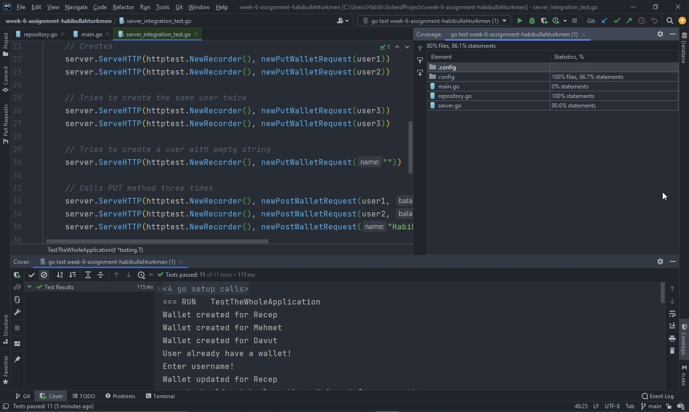

# Week 6 Assignment

In this assignment, we expect to you develop a configurable backend service that having the following business requirements:

First of all, see [configuration file for local environment.](.config/local.json)

`GET /` endpoint should return all username and wallet balance.

`GET /:username` endpoint should return wallet balance of username.

`PUT /:username` endpoint should create a wallet by username. The initial value of balance will be set from configuration file as `initialBalanceAmount` variable. If the wallet exists, don't update existed wallet and return same response as created.

`POST /:username` endpoint should update wallet balance by `json` body. 
* `{ "balance": POSITIVE_NUMBER }` should increase balance by `POSITIVE_NUMBER`
* `{ "balance": NEGATIVE_NUMBER }` should descrease balance by `NEGATIVE_NUMBER`. Wallet balance amount never belows `minimumBalanceAmount`. If decreased amount will below `minimumBalanceAmount` then you should return an error.

## Implementation
Backend service that having the following technical requirements:

* Use only Go's standart libraries.
* Implementation should be made with Layered Architecture:
Controller(Handler)->Service->Data(Repository).
* Test coverage should be at least %85.
* Free to use any DB(In-Memory(no-db), SQL, NoSQL)

## Solution
Run server by typing `go run .`

### Run Test
```
go test ./...
go test -v ./...
```

### Run Test Coverage
```
go test -coverprofile=cover.txt ./...
go tool cover -html=cover.txt -o cover.html
```

Open `cover.html` file to see coverage report.

## Instructions

### PUT

PUTs/Creates three user wallets
```bash
# Creates wallet for Habib, and the return value is "Wallet created for Habib"
$ curl -X PUT http://localhost:5000/Habib
```
return value `Wallet created for Habib`

```bash
# Creates wallet for Yahya, and the return value is "Wallet created for Yahya"
$ curl -X PUT http://localhost:5000/Yahya
```
return value `Wallet created for Yahya`

```bash
# Creates wallet for Burcu, and the return value is "Wallet created for Burcu"
$ curl -X PUT http://localhost:5000/Burcu
```
return value `Wallet created for Burcu`

### GET
```bash
# GET all users
$ curl -X GET http://localhost:5000/
{"Burcu":0,"Habib":0,"Yahya":0}

# GET Yahya with uppercase "Y"
$ curl -X GET http://localhost:5000/Yahya
{"Yahya":0}

# GET Habib with lowercase letters "habib"
$ curl -X GET http://localhost:5000/habib
{"Habib":0}

# GET Burcu with uppercase letters "BURCU"
$ curl -X GET http://localhost:5000/BURCU
{"Burcu":0}
```

### POST

```bash
# Increase Habib's balance by 2000, and the return value is "Wallet updated for Habib"
curl -i -X POST -H "Content-Type: application/json" -d "{\"balance\":2000}" http://localhost:5000/Habib
```
Return value `Wallet updated for Habib`

```bash
# Decreases Habib's balance by 1000, and the return value is "Wallet updated for Habib"
curl -i -X POST -H "Content-Type: application/json" -d "{\"balance\":-1000}" http://localhost:5000/Habib
```
Return value `Wallet updated for Habib`

```bash
# Yahya's balance is 0 and the below POST method tries to decrease Yahya's balance by -1000, 
# but it doesn't allow to decrease it below -100, because minimum balance amount is -100,
# so Yahya's balance is still 0 and the return value is "amount should not be less than minimum balance amount"
curl -i -X POST -H "Content-Type: application/json" -d "{\"balance\":-1000}" http://localhost:5000/Yahya
```
Return value `amount should not be less than minimum balance amount`

```bash
# Tries to decrease Mehmet's balance by 1000 but Mehmet doesn't have a wallet, and the return value is "User not found!"
curl -i -X POST -H "Content-Type: application/json" -d "{\"balance\":-1000}" http://localhost:5000/Mehmet
```
Return value `User not found!`

```bash
# Decreases Burcu's balance by 50, and the return value is "Wallet updated for burcu"
curl -i -X POST -H "Content-Type: application/json" -d "{\"balance\":-50}" http://localhost:5000/burcu
```
Return value `Wallet updated for burcu`

```bash
# GETs all wallets
$ curl -X GET http://localhost:5000/
{"Burcu":-50,"Habib":1000,"Yahya":0}
```

### Coverage Results
```
server.go 90.06% Statements
repository.go 100% Statements
```
#### Coverage screenshot

